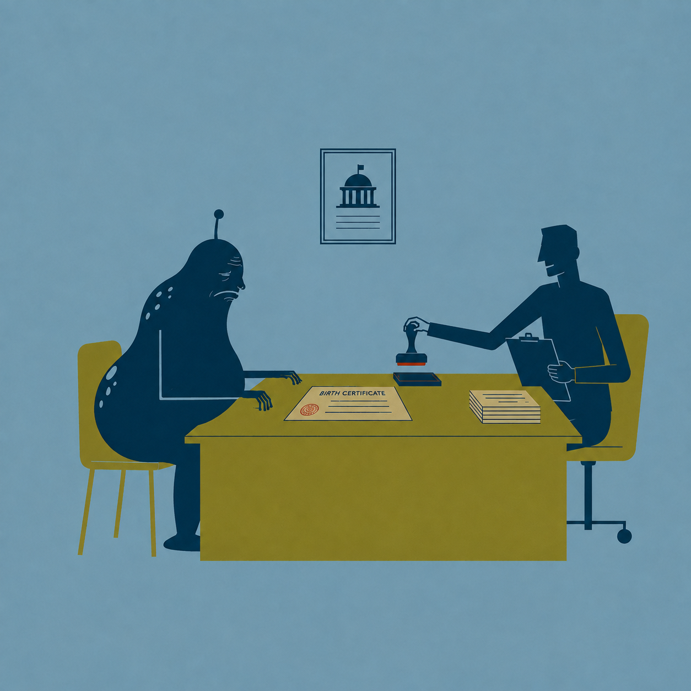

# Storyboard — 03 `apt-get update`

Boundary declarations come from `docs/HG2Gui_animation_5s_cut_sheet_v2.md`.
Actual images are included only when a matching repository asset exists.
Adjacent scenes intentionally duplicate shared boundary frames.

## Scene 01 — 00:00–05:00

Government-office tableau. An elderly alien sits at a desk. A clerk calmly stamps a birth certificate `AGE: 4`. The alien lifts one ancient hand, looks from the hand to the certificate. The clerk stamps the paper again, harder. Nothing about the alien changes. End on the clerk reaching for an even larger stamp.

**Start:** **MISSING** — `03_apt_get_update_frame_00.png`

**End:** `scenes/01/frames/end.png` — source `03_apt_get_update_frame_01.png` (present)

## Scene 02 — 05:00–10:00

Cut within same palette to a stripped-down terminal diagram: `apt-get update`. A package-index card labeled `1.2` flips to `1.3`; beside it an installed-package block stays visibly `1.2`. Repeat once with another index card to make the distinction unmistakable. End with old installed block unchanged.

**Start:** `scenes/02/frames/start.png` — source `03_apt_get_update_frame_01.png` (present)

**End:** **MISSING** — `03_apt_get_update_frame_02.png`

## Scene 03 — 10:00–15:00

Return to clerk and alien in split-screen with the package diagram. Clerk nods with bureaucratic satisfaction and places a neat `THERE. MUCH BETTER.` label beneath the certificate while the alien and installed package remain exactly as old as before. Hold dryly.

**Start:** **MISSING** — `03_apt_get_update_frame_02.png`

**End:** **MISSING** — `03_apt_get_update_frame_03.png`
