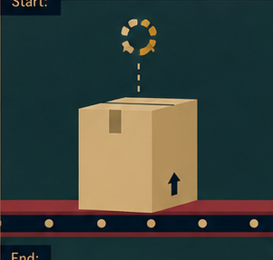
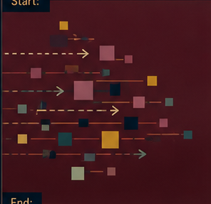
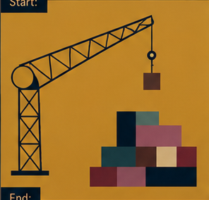
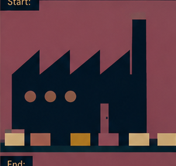
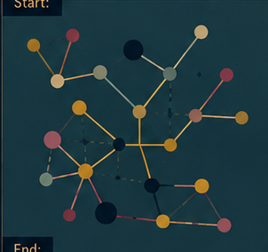
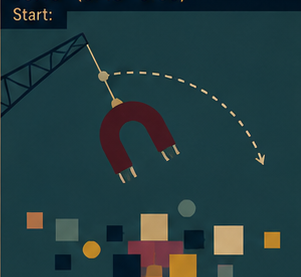
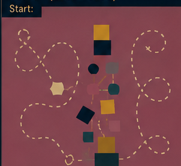
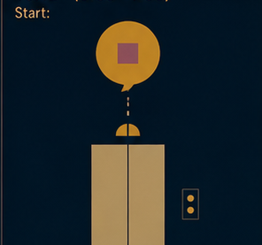

# Storyboard — 02_pkg_install_small_empire_of_dependencies

Source cut map: `docs/script (3).md`.
The tangent source declares one frame per cut rather than explicit START/END pairs.
Each declared cut-map frame is treated as that cut's end boundary; the previous cut's frame is reused as the next cut's start boundary.
The first scene's start remains unresolved unless a preceding frame is actually declared elsewhere.

## Scene 01

Package management began as the profession of delivering one thing.

**Start:** **UNRESOLVED** — no declared filename

**End:** `scenes/01/frames/end.png` — source `package_01.png` (present)

## Scene 02

Packages were granted the right to arrive with what they needed.

**Start:** `scenes/02/frames/start.png` — source `package_01.png` (present)

**End:** `scenes/02/frames/end.png` — source `package_02.png` (present)

## Scene 03

The first package requested an additional package.

**Start:** `scenes/03/frames/start.png` — source `package_02.png` (present)

**End:** `scenes/03/frames/end.png` — source `package_03.png` (present)

## Scene 04

Things began to arrive.

**Start:** `scenes/04/frames/start.png` — source `package_03.png` (present)

**End:** `scenes/04/frames/end.png` — source `package_04.png` (present)

## Scene 05

Then more things.

**Start:** `scenes/05/frames/start.png` — source `package_04.png` (present)

**End:** `scenes/05/frames/end.png` — source `package_05.png` (present)

## Scene 06

Warehouses became factories.

**Start:** `scenes/06/frames/start.png` — source `package_05.png` (present)

**End:** `scenes/06/frames/end.png` — source `package_06.png` (present)

## Scene 07

Factories acquired supply chains, which acquired relationships.

**Start:** `scenes/07/frames/start.png` — source `package_06.png` (present)

**End:** `scenes/07/frames/end.png` — source `package_07.png` (present)

## Scene 08

Balance was introduced as a theoretical objective.

**Start:** `scenes/08/frames/start.png` — source `package_07.png` (present)

**End:** `scenes/08/frames/end.png` — source `package_08.png` (present)

## Scene 09

The original package remained somewhere in the resulting economy.

**Start:** `scenes/09/frames/start.png` — source `package_08.png` (present)

**End:** `scenes/09/frames/end.png` — source `package_09.png` (present)

## Scene 10

A specialist search department was formed.

**Start:** `scenes/10/frames/start.png` — source `package_09.png` (present)

**End:** `scenes/10/frames/end.png` — source `package_10.png` (present)

## Scene 11

Confidence fluctuated according to departmental requirements.

**Start:** `scenes/11/frames/start.png` — source `package_10.png` (present)

**End:** `scenes/11/frames/end.png` — source `package_11.png` (present)

## Scene 12

Modern package managers automate the whole thing. `pkg install` resolves and installs dependencies.

**Start:** `scenes/12/frames/start.png` — source `package_11.png` (present)

**End:** `scenes/12/frames/end.png` — source `package_12.png` (present)

