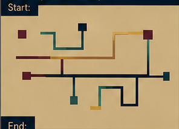

# Storyboard — 22_find_cartographical_disaster

Source cut map: `docs/script.md`.
The tangent source declares one frame per cut rather than explicit START/END pairs.
Each declared cut-map frame is treated as that cut's end boundary; the previous cut's frame is reused as the next cut's start boundary.
The first scene's start remains unresolved unless a preceding frame is actually declared elsewhere.

## Scene 01

`find` is named after the Cartographical Disaster of Nth.

**Start:** **UNRESOLVED** — no declared filename

**End:** `scenes/01/frames/end.png` — source `cartography_01.png` (present)

## Scene 02

Maps had to show every legitimate route. Comprehensiveness required detours.

**Start:** `scenes/02/frames/start.png` — source `cartography_01.png` (present)

**End:** `scenes/02/frames/end.png` — source `cartography_02.png` (present)

## Scene 03

Detours required signs; signs required a definition of forward.

**Start:** `scenes/03/frames/start.png` — source `cartography_02.png` (present)

**End:** `scenes/03/frames/end.png` — source `cartography_03.png` (present)

## Scene 04

Maps began including travellers who had not decided to travel.

**Start:** `scenes/04/frames/start.png` — source `cartography_03.png` (present)

**End:** `scenes/04/frames/end.png` — source `cartography_04.png` (present)

## Scene 05

Routes eventually outnumbered destinations.

**Start:** `scenes/05/frames/start.png` — source `cartography_04.png` (present)

**End:** `scenes/05/frames/end.png` — source `cartography_05.png` (present)

## Scene 06

Cartographers abolished routes. Unix `find` asks where to start and what to match.

**Start:** `scenes/06/frames/start.png` — source `cartography_05.png` (present)

**End:** `scenes/06/frames/end.png` — source `cartography_06.png` (present)

