# Storyboard — 23_cat_theological_mechanical_history

Source cut map: `docs/script (1).md`.
The tangent source declares one frame per cut rather than explicit START/END pairs.
Each declared cut-map frame is treated as that cut's end boundary; the previous cut's frame is reused as the next cut's start boundary.
The first scene's start remains unresolved unless a preceding frame is actually declared elsewhere.

## Scene 01

The word `cat` entered computing through a disagreement over which way up a cat goes.

**Start:** **UNRESOLVED** — no declared filename

**End:** `scenes/01/frames/end.png` — source `cat_01.png` (present)

## Scene 02

This was not initially considered difficult. Cats corrected the record.

**Start:** `scenes/02/frames/start.png` — source `cat_01.png` (present)

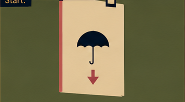

**End:** `scenes/02/frames/end.png` — source `cat_02.png` (present)

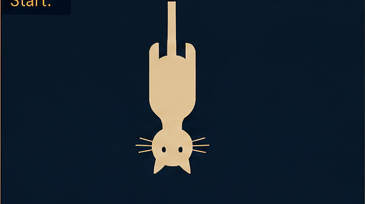

## Scene 03

A cat regards whichever surface it occupies as the upper surface.

**Start:** `scenes/03/frames/start.png` — source `cat_02.png` (present)

**End:** `scenes/03/frames/end.png` — source `cat_03.png` (present)

## Scene 04

Turning the cat over merely gives the universe a new upper surface.

**Start:** `scenes/04/frames/start.png` — source `cat_03.png` (present)

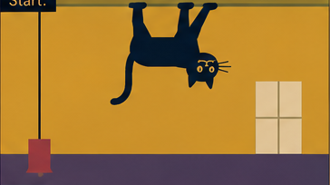

**End:** `scenes/04/frames/end.png` — source `cat_04.png` (present)

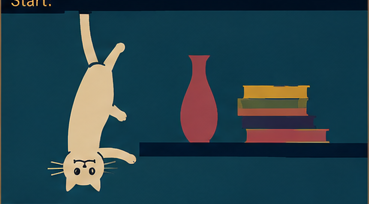

## Scene 05

The Egyptians discovered this and mistook standardization for divinity.

**Start:** `scenes/05/frames/start.png` — source `cat_04.png` (present)

**End:** `scenes/05/frames/end.png` — source `cat_05.png` (present)

## Scene 06

The principle spread.

**Start:** `scenes/06/frames/start.png` — source `cat_05.png` (present)

**End:** `scenes/06/frames/end.png` — source `cat_06.png` (present)

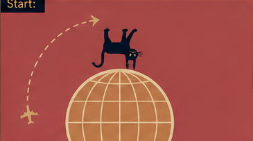

## Scene 07

Observational research continued, mostly because the subject refused peer review.

**Start:** `scenes/07/frames/start.png` — source `cat_06.png` (present)

**End:** `scenes/07/frames/end.png` — source `cat_07.png` (present)

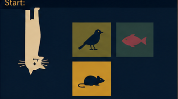

## Scene 08

Physicists tested gravity. Gravity worked. The cat declined to participate.

**Start:** `scenes/08/frames/start.png` — source `cat_07.png` (present)

**End:** `scenes/08/frames/end.png` — source `cat_08.png` (present)

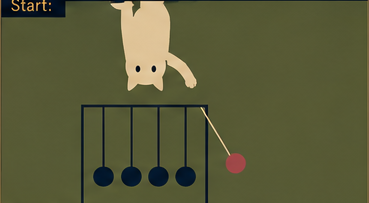

## Scene 09

Further studies established a strong institutional preference for night.

**Start:** `scenes/09/frames/start.png` — source `cat_08.png` (present)

**End:** `scenes/09/frames/end.png` — source `cat_09.png` (present)

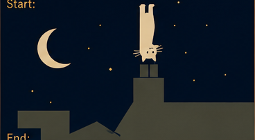

## Scene 10

Food selection was classified as constitutional law.

**Start:** `scenes/10/frames/start.png` — source `cat_09.png` (present)

**End:** `scenes/10/frames/end.png` — source `cat_10.png` (present)

## Scene 11

Hierarchy was accepted only when the cat occupied its highest point.

**Start:** `scenes/11/frames/start.png` — source `cat_10.png` (present)

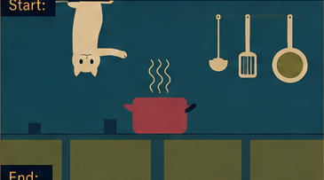

**End:** `scenes/11/frames/end.png` — source `cat_11.png` (present)

## Scene 12

Computing shortened concatenate to `cat`; Unix writes file contents in sequence.

**Start:** `scenes/12/frames/start.png` — source `cat_11.png` (present)

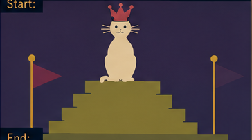

**End:** `scenes/12/frames/end.png` — source `cat_12.png` (present)

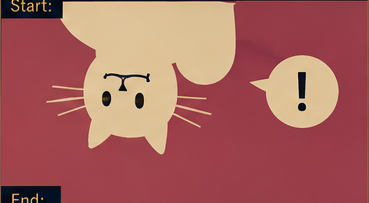
