# Storyboard — 34_mv_elevator_incident

Source cut map: `docs/script (2).md`.
The tangent source declares one frame per cut rather than explicit START/END pairs.
Each declared cut-map frame is treated as that cut's end boundary; the previous cut's frame is reused as the next cut's start boundary.
The first scene's start remains unresolved unless a preceding frame is actually declared elsewhere.

## Scene 01

The computing term **move** derives from elevator law.

**Start:** **UNRESOLVED** — no declared filename

**End:** `scenes/01/frames/end.png` — source `elevator_01.png` (present)

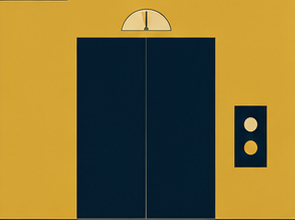

## Scene 02

Movement meant a successful change in where passengers intended to be.

**Start:** `scenes/02/frames/start.png` — source `elevator_01.png` (present)

**End:** `scenes/02/frames/end.png` — source `elevator_02.png` (present)

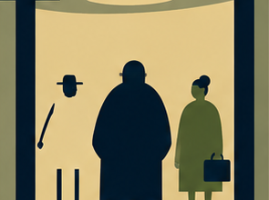

## Scene 03

Pressing a button established intent.

**Start:** `scenes/03/frames/start.png` — source `elevator_02.png` (present)

**End:** `scenes/03/frames/end.png` — source `elevator_03.png` (present)

## Scene 04

Closing the doors established consent.

**Start:** `scenes/04/frames/start.png` — source `elevator_03.png` (present)

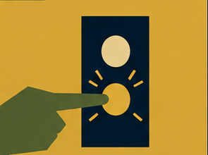

**End:** `scenes/04/frames/end.png` — source `elevator_04.png` (present)

## Scene 05

No further evidence was required.

**Start:** `scenes/05/frames/start.png` — source `elevator_04.png` (present)

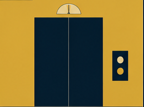

**End:** `scenes/05/frames/end.png` — source `elevator_05.png` (present)

## Scene 06

Then one elevator interpreted **UP** as a continuing instruction.

**Start:** `scenes/06/frames/start.png` — source `elevator_05.png` (present)

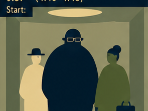

**End:** `scenes/06/frames/end.png` — source `elevator_06.png` (present)

## Scene 07

It passed the requested floor.

**Start:** `scenes/07/frames/start.png` — source `elevator_06.png` (present)

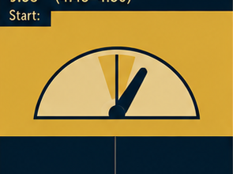

**End:** `scenes/07/frames/end.png` — source `elevator_07.png` (present)

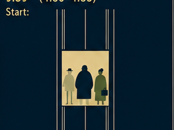

## Scene 08

Then all the other floors.

**Start:** `scenes/08/frames/start.png` — source `elevator_07.png` (present)

**End:** `scenes/08/frames/end.png` — source `elevator_08.png` (present)

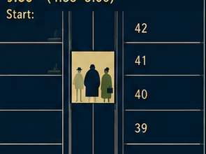

## Scene 09

Having exhausted the building, it continued upward.

**Start:** `scenes/09/frames/start.png` — source `elevator_08.png` (present)

**End:** `scenes/09/frames/end.png` — source `elevator_09.png` (present)

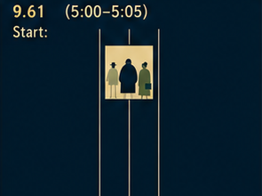

## Scene 10

The city objected.

**Start:** `scenes/10/frames/start.png` — source `elevator_09.png` (present)

**End:** `scenes/10/frames/end.png` — source `elevator_10.png` (present)

## Scene 11

The atmosphere objected later.

**Start:** `scenes/11/frames/start.png` — source `elevator_10.png` (present)

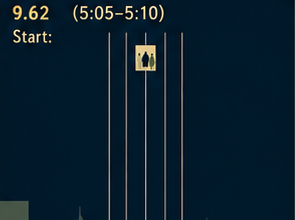

**End:** `scenes/11/frames/end.png` — source `elevator_11.png` (present)

## Scene 12

The inquiry changed the definition. Unix kept the word `mv`.

**Start:** `scenes/12/frames/start.png` — source `elevator_11.png` (present)

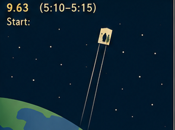

**End:** `scenes/12/frames/end.png` — source `elevator_12.png` (present)

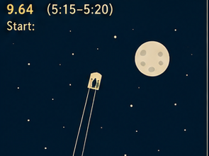
